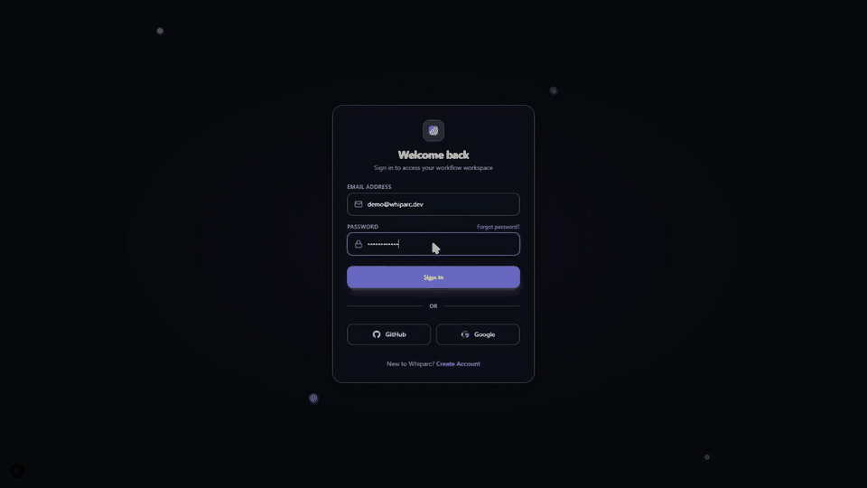

# Whiparc

[](NOTICE.md)
[](https://github.com/whiparc/whiparc/actions/workflows/ci.yml)
[](CODE_OF_CONDUCT.md)

<p align="center">
  
</p>

Whiparc (formerly InfraCanvas) is a visual orchestration web
platform designed to unify infrastructure-as-code provisioning (Terraform),
configuration management (Ansible), and container orchestration (Kubernetes)
into a single, interactive drag-and-drop workspace. By placing node blocks
on a visual editor and linking them together, team members can automatically
generate deployable, modular infrastructure bundles.

This project is built as a monorepo containing a Next.js web application
utilizing ReactFlow for visual node mapping, and a Go runner API backend
that executes deployment bundles in a simulated sandbox environment.

## Contents

- [Technical Stack](#technical-stack)
- [Directory Structure](#directory-structure)
- [Features](#features)
- [Quickstart](#quickstart)
- [License](#license)
- [Contributing](#contributing)
- [Security](#security)

---

## Technical Stack

### Frontend
- Core Framework: Next.js 16 (App Router) & React 19
- Visual Mapping: @xyflow/react (ReactFlow)
- State Management: Zustand
- Styling: TailwindCSS & Vanilla CSS
- Package Compilation: JSZip

### Backend
- Core Language: Go 1.23
- WebSockets: Gorilla WebSocket (for live run logs streaming)
- Database: SQLite (via modernc.org/sqlite, pure Go without CGO dependencies)

### DevOps Sandbox
- Cloud Simulation: LocalStack (AWS VPC, EC2, S3, RDS API mock)
- Server Simulation: Ubuntu SSH Docker containers
- Automation Tools: Terraform, Ansible, and Kubectl (installed inside the runner base image)

---

## Directory Structure

```text
whiparc/
├── apps/
│   ├── api/                 # Go runner API backend (BSL 1.1)
│   ├── cli/                 # infracanvas CLI + local Sandbox Agent (MIT)
│   └── web/                 # Next.js web workspace frontend (BSL 1.1)
├── sandbox/                 # Mock DevOps cloud environment configuration (MIT)
├── docs/                    # Contributor-facing setup docs
├── package.json             # Root Monorepo configuration
├── turbo.json                # Turborepo task runner configuration
└── docker-compose.yml         # Production-ready compose configuration containing the API + sandbox resources
```

See [NOTICE.md](NOTICE.md) for exactly which license applies to which
directory.

---

## Features

1. **Multi-format compilers** — Topological Ansible playbook compilation,
   dynamic multi-resource Terraform (HCL) generation, and Kubernetes
   manifest compilation, all driven by the canvas graph
   (`apps/web/app/lib/exportYaml.ts`, `bundleGenerator.ts`). Includes
   source-fetch and target-environment nodes, and a ZIP bundle export of the
   full `terraform/`/`ansible/`/`k8s/` output.
2. **Execution runner & sandbox** — A Go runner executes deploy/destroy
   pipelines against a LocalStack + SSH-container sandbox (or real cloud
   credentials), with per-node live status tracking streamed over
   WebSockets and a persisted run history in SQLite.
3. **Visual canvas** — ReactFlow-based editor with Select/Pan/Link
   interaction modes, execution-safety locking during active runs, and
   optimistic-locked autosave.
4. **Auth, RBAC & credential vault** — Email/password and social login
   (Google/GitHub OAuth), JWT sessions, project-scoped RBAC (Admin/Editor/
   Viewer), and an AES-256-GCM vault for AWS/GCP/SSH credentials.
5. **Real-time collaboration** — WebSocket-based room sync with live cursor
   tracking, node locks, and project workspace/access-request workflows.
6. **CLI & reverse import** — A cross-platform `infracanvas` CLI for
   login, project, and pipeline management, plus an HCL/YAML AST-based
   reverse importer that turns existing `.tf`/`.yml` files into canvas
   nodes.
7. **Premium custom node authoring** — Author custom nodes with
   HCL/YAML payloads, validated server-side via Go AST parsers and
   compiled into the standard Terraform/Ansible/K8s output alongside
   built-in node types.

For known gaps between the UI and what's actually wired up, see
[ROADMAP.md](ROADMAP.md).

---

## Quickstart

Prerequisites: Node.js (v18+), Go (v1.22+), Docker and Docker Compose.

```bash
# 1. Generate the sandbox SSH keypair (skip if you already have one)
ssh-keygen -t rsa -b 4096 -f sandbox/id_rsa -N ""

# 2. Start the local DevOps sandbox (LocalStack + SSH targets)
docker compose -f sandbox/docker-compose.sandbox.yml up -d

# 3. Install dependencies and start the app
npm install
npm run dev
```

This starts the Next.js frontend at `http://localhost:3000` and the Go API
at `http://localhost:8080`.

For OAuth setup, running services independently, or running everything in
Docker, see [docs/DEVELOPMENT.md](docs/DEVELOPMENT.md).

---

## License

Whiparc is **open-core**: the canvas, compilers, and runner
(`apps/web/`, `apps/api/`) are under the **Business Source License 1.1**
(source-available; free to self-host, not free to resell as a competing
hosted service). The CLI,
sandbox configs, and experimental code (`apps/cli/`, `sandbox/`,
`spikes/`) are **MIT**.

See [NOTICE.md](NOTICE.md) for the full path-by-path breakdown and
[LICENSE](LICENSE) for the BSL terms.

---

## Contributing

Contributions are welcome — see [CONTRIBUTING.md](CONTRIBUTING.md) for dev
setup, branch/PR conventions, and how the license split affects where a
CLA is required. Participation is governed by the
[Code of Conduct](CODE_OF_CONDUCT.md).

## Security

Please report vulnerabilities privately — see [SECURITY.md](SECURITY.md).
Do not open a public issue for security reports.
