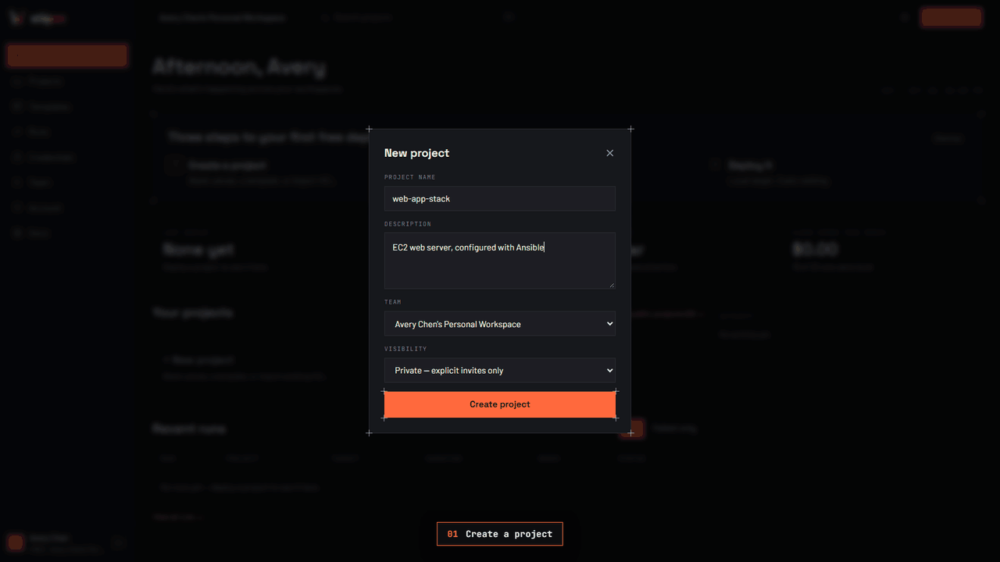

<p align="center">
  <picture>
    <source media="(prefers-color-scheme: dark)" srcset="docs/assets/logo-horizontal-cutout-light-text.png">
    
  </picture>
</p>

# Whiparc

[](NOTICE.md)
[](https://github.com/whiparc/whiparc/actions/workflows/ci.yml)
[](CODE_OF_CONDUCT.md)

<p align="center">
  
</p>

Whiparc is a visual workspace for deployments. You drag infrastructure
(Terraform), configuration (Ansible) and container (Kubernetes) building
blocks onto a canvas, connect them, and Whiparc compiles the graph into
deployable, modular code that you can preview, export as a ZIP, or run
against a local sandbox or your own cloud account.

This repository is a monorepo: a Next.js web application built around
ReactFlow, a Go API that stores projects and runs deployment bundles, and a
cross-platform Go CLI.

## Contents

- [How it works](#how-it-works)
- [Features](#features)
- [Quickstart](#quickstart)
- [Repository layout](#repository-layout)
- [Technical stack](#technical-stack)
- [Documentation](#documentation)
- [Community and support](#community-and-support)
- [License](#license)
- [Contributing](#contributing)
- [Security](#security)

---

## How it works

1. **Create a project.** Start from a blank canvas, a template, or by
   importing existing `.tf` / `.yml` files.
2. **Drag nodes onto the canvas.** The library covers cloud targets,
   Terraform resources, Ansible tasks and Kubernetes objects. Select a node
   to edit its parameters in the right-hand panel.
3. **Connect them.** Edges define ordering and data flow between nodes.
4. **Generate and run.** Open Code Preview to inspect the generated
   `main.tf`, `playbook.yml`, manifests and inventory, export the full
   bundle as a ZIP, or deploy it from the workspace.

---

## Features

1. **Multi-format compilers.** Topological Ansible playbook compilation,
   dynamic multi-resource Terraform (HCL) generation, and Kubernetes
   manifest compilation, all driven by the canvas graph
   (`apps/web/app/lib/exportYaml.ts`, `bundleGenerator.ts`). Includes
   source-fetch and target-environment nodes, and a ZIP export of the full
   `terraform/`, `ansible/` and `k8s/` output.
2. **Execution runner and sandbox.** A Go runner executes deploy and
   destroy pipelines against a LocalStack and SSH-container sandbox (or
   real cloud credentials), with per-node live status streamed over
   WebSockets and a persisted run history.
3. **Visual canvas.** ReactFlow-based editor with always-on pan and zoom,
   execution-safety locking during active runs, snapshot history, and
   optimistic-locked autosave.
4. **Auth, RBAC and credential vault.** Email/password and social login
   (Google, GitHub), JWT sessions, project-scoped roles (Admin, Editor,
   Viewer), teams, and an AES-256-GCM vault for AWS, GCP and SSH
   credentials.
5. **Real-time collaboration.** WebSocket room sync with live cursors,
   node locks, and project access-request workflows.
6. **CLI and reverse import.** A cross-platform `whiparc` CLI for login,
   project and pipeline management, plus an HCL/YAML AST-based importer
   that turns existing `.tf` and `.yml` files into canvas nodes.
7. **Custom nodes and templates.** Author custom nodes from HCL or YAML
   (validated server-side with Go AST parsers), and publish or fork
   projects through the template catalog.

Known gaps between the UI and what is wired up are tracked in
[ROADMAP.md](ROADMAP.md).

---

## Quickstart

Prerequisites: Node.js 20.9 or newer, Go 1.26 or newer, Docker with Docker
Compose.

```bash
# 1. Generate the sandbox SSH keypair (skip if you already have one)
ssh-keygen -t rsa -b 4096 -f sandbox/id_rsa -N ""

# 2. Start the local DevOps sandbox (LocalStack + SSH targets)
docker compose -f sandbox/docker-compose.sandbox.yml up -d

# 3. Install dependencies and start the app
npm install
npm run dev
```

This starts the Next.js frontend at `http://localhost:3000` and the Go API
at `http://localhost:8080` in one terminal. The first page load compiles on
demand and can take a minute.

Create an account on the sign-in page to get started. No mail provider is
configured locally, so the email verification link is printed in the API's
terminal output instead of being sent.

> **Port 8080 note:** `npm run dev` runs its own API on `8080`, so don't run
> it alongside `docker compose up` or `docker compose -f docker-compose.hosted.yml up`
> (they publish `8080` too). If you want a Docker backend, start only the
> frontend with `npm run dev --workspace=web`. The full table is in
> [docs/DEVELOPMENT.md](docs/DEVELOPMENT.md#choosing-how-to-run-the-backend-port-8080).

For OAuth setup, running services independently, running the tests, or
running everything in Docker, see [docs/DEVELOPMENT.md](docs/DEVELOPMENT.md).

---

## Repository layout

```text
whiparc/
├── apps/
│   ├── api/                 # Go API: auth, RBAC, runner, vault, realtime sync (BSL 1.1)
│   ├── cli/                 # whiparc CLI and local Sandbox Agent (MIT)
│   └── web/                 # Next.js workspace, dashboard and marketing site (BSL 1.1)
├── sandbox/                 # Local DevOps sandbox: LocalStack and SSH targets (MIT)
├── spikes/                  # Experimental code, not part of the shipped product (MIT)
├── installers/              # CLI installers: Windows (NSIS, winget), macOS pkg, Linux deb/rpm
├── deploy/                  # Reverse proxy and backup config for the hosted deployment
├── docs/                    # Contributor documentation and README assets
├── .github/                 # CI workflows, issue and PR templates, CODEOWNERS
├── package.json             # npm workspace root (Turborepo)
├── turbo.json               # Turborepo task configuration
├── docker-compose.yml       # Backend in Docker: API and sandbox, SQLite
└── docker-compose.hosted.yml  # Backend in Docker with Postgres (hosted-shaped)
```

See [NOTICE.md](NOTICE.md) for exactly which license applies to which
directory.

---

## Technical stack

| Area | Technology |
| :--- | :--- |
| Frontend | Next.js 16 (App Router), React 19, `@xyflow/react` (ReactFlow), Zustand, Tailwind CSS 4, JSZip |
| API | Go 1.26, Gorilla WebSocket, HashiCorp HCL for parsing, SQLite via `modernc.org/sqlite` (pure Go, no CGO) for local development, Postgres via pgx for hosted deployments |
| CLI | Go (Cobra), per-OS installers |
| Sandbox | LocalStack (AWS API mock), Ubuntu SSH containers |
| Automation tools | Terraform, Ansible and kubectl, installed in the runner base image |

---

## Documentation

| Document | What it covers |
| :--- | :--- |
| [docs/DEVELOPMENT.md](docs/DEVELOPMENT.md) | Full local setup, running each service, tests, Docker, hosted-stack testing, CLI configuration |
| [docs/ARCHITECTURE.md](docs/ARCHITECTURE.md) | How the pieces fit together: canvas, compilers, API, runner, sandbox, CLI |
| [CONTRIBUTING.md](CONTRIBUTING.md) | Branching, pull requests, commit style, review expectations, license split |
| [ROADMAP.md](ROADMAP.md) | Known gaps and where help is most useful |
| [docs/RELEASE_SIGNING.md](docs/RELEASE_SIGNING.md) | CLI installer signing and release pipeline |
| [NOTICE.md](NOTICE.md) | Path-by-path license breakdown |
| [SECURITY.md](SECURITY.md) | How to report a vulnerability |
| [SUPPORT.md](SUPPORT.md) | Where to ask questions and get help |

Per-app notes live next to the code: [apps/web](apps/web/README.md),
[apps/api](apps/api/README.md), [apps/cli](apps/cli/README.md).

---

## Community and support

- Questions and ideas: [GitHub Discussions](https://github.com/whiparc/whiparc/discussions).
- Bugs and feature requests: [GitHub Issues](https://github.com/whiparc/whiparc/issues)
  using the templates.
- Looking for a first contribution: filter issues by
  [`good first issue`](https://github.com/whiparc/whiparc/labels/good%20first%20issue)
  or [`help wanted`](https://github.com/whiparc/whiparc/labels/help%20wanted).
- Hosted product and pricing: [whiparc.com](https://whiparc.com).

---

## License

Whiparc is **open-core**: the canvas, compilers, and runner
(`apps/web/`, `apps/api/`) are under the **Business Source License 1.1**
(source-available; free to self-host, not free to resell as a competing
hosted service). The CLI, sandbox configs, and experimental code
(`apps/cli/`, `sandbox/`, `spikes/`) are **MIT**.

See [NOTICE.md](NOTICE.md) for the full path-by-path breakdown and
[LICENSE](LICENSE) for the BSL terms.

---

## Contributing

Contributions are welcome. See [CONTRIBUTING.md](CONTRIBUTING.md) for dev
setup, branch and PR conventions, and how the license split affects where a
CLA is required. Participation is governed by the
[Code of Conduct](CODE_OF_CONDUCT.md).

The default branch is `dev` (the integration branch; open PRs against it).
`main` is the released, deployed branch, so a fresh clone may be slightly
ahead of what is live at whiparc.com.

## Security

Please report vulnerabilities privately. See [SECURITY.md](SECURITY.md).
Do not open a public issue for security reports.
