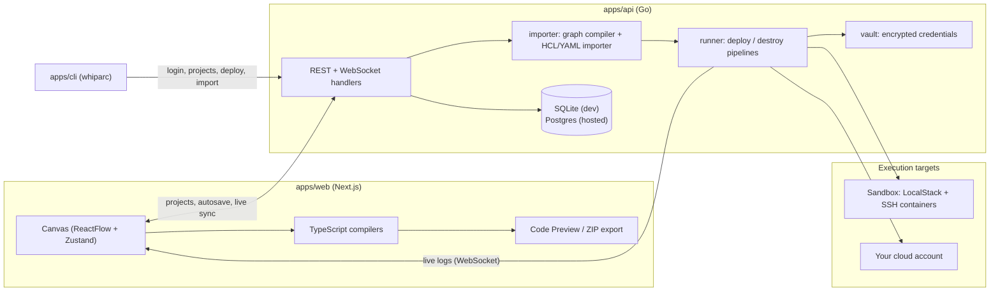

# Architecture Overview

A map of how Whiparc fits together, aimed at someone reading the code for the
first time. For setup, see [DEVELOPMENT.md](DEVELOPMENT.md); for licensing of
each part, see [NOTICE.md](../NOTICE.md).

## The idea

A project is a **graph**: nodes are infrastructure building blocks (a cloud
target, a Terraform resource, an Ansible task, a Kubernetes object) and edges
express ordering and data flow between them. Everything else in the repo
either edits that graph, turns it into code, or executes the code.

## Components

### `apps/web`: workspace, dashboard and marketing site

Next.js 16 App Router with React 19. Each top-level folder under
`apps/web/app/` is a route (`dashboard`, `workspace`, `templates`, `runs`,
`credentials`, `team`, `account`, `docs`, `login`, and so on).

| Path | Role |
| :--- | :--- |
| `app/workspace/page.tsx` | The canvas editor: ReactFlow wiring, drag-and-drop, connections, autosave, run console |
| `app/workspace/LibraryPanelV2.tsx` | The left-hand node library; each entry sets `application/reactflow-*` drag data that the canvas reads on drop |
| `app/components/ReactFlowCanvasNode.tsx`, `canvas/` | Node and edge rendering |
| `app/store/` | Zustand stores: `useCanvasStore` (graph, selection, custom nodes) and `useAuthStore` (session) |
| `app/lib/exportYaml.ts`, `bundleGenerator.ts`, `terraformDefaults.ts` | TypeScript compilers that turn the graph into Terraform, Ansible and Kubernetes files, plus ZIP packaging |
| `app/components/landing-v2/` | Marketing site sections |
| `app/docs/DocsPageV2.tsx` | In-app user documentation (including its search index) |

The UI is moving to the "blueprint" design system (`app/components/ui/blueprint.css`
and per-page `*.css` files). Pages ending in `V2` are on it; check a page's
imports before mixing styling approaches.

### `apps/api`: Go API and runner

A single Go `main` package plus a few sub-packages. Routes are registered in
`apps/api/main.go`.

| Area | Where |
| :--- | :--- |
| Auth, sessions, OAuth, email verification, password reset | `auth.go`, `oauth.go`, `email_*.go`, `password_*.go` |
| Projects, members, invitations, canvas state, snapshots | `projects.go`, `teams.go`, `snapshots.go` |
| Real-time collaboration | WebSocket handler at `GET /api/workspace/{projectId}/sync` |
| Graph compilation (server side) | `importer/compiler.go` |
| Reverse import of `.tf` / `.yml` / Kubernetes files | `importer/` (HCL via `hashicorp/hcl`) |
| Deploy and destroy pipelines, live logs | `runner/`, WebSocket at `/api/ws/runs/{id}` |
| Credential encryption | `vault/` |
| Custom node validation | `custom_node_validator.go` |
| Plans, entitlements, billing webhooks | `entitlements.go`, `billing.go` |
| Database abstraction and migrations | `db_driver.go`, `migrations.go` |

Data lives in SQLite for local development and in Postgres for hosted
deployments. `db_driver.go` is the single abstraction point: one
SQLite-dialect schema is the source of truth and a small rebinding layer
adapts queries to Postgres. New raw SQL should be written in SQLite's dialect
(see [DEVELOPMENT.md](DEVELOPMENT.md#testing-against-the-hosted-stack-postgres-locally)).
Schema changes go through numbered migrations in `migrations.go`.

### Two compilers

The graph is compiled in two places:

- In the browser (`apps/web/app/lib/`) for Code Preview and ZIP export.
- On the server (`apps/api/importer/compiler.go`) when a deploy request does
  not carry pre-built files.

When you change how a node type compiles, check both and keep their output
consistent.

### Run flow

1. The workspace (or `whiparc deploy`) calls the deploy endpoint for a project.
2. The API loads the saved canvas, compiles it if needed, resolves credentials
   from the vault, and records a run.
3. `runner.RunPipeline` writes the files to a temporary run directory and
   invokes Terraform, Ansible and kubectl as needed, scrubbing secrets from
   the output it streams.
4. Per-node status and log lines stream to the browser over the run
   WebSocket; the final log and status are persisted with the run.

A canvas whose target points at the local sandbox runs against LocalStack
and the SSH containers; any other target needs real credentials configured
for the project.

### `sandbox`: local DevOps sandbox

`sandbox/docker-compose.sandbox.yml` starts LocalStack (an AWS API mock on
port 4566) and two Ubuntu SSH containers (ports 2222 and 2223). It gives
contributors something to deploy to without a cloud account. It is a
development fixture, not a security boundary.

### `apps/cli`: `whiparc` CLI

A Cobra-based Go program. Command groups:

| Command | Purpose |
| :--- | :--- |
| `login`, `logout` | Authenticate against an API and store or clear the token |
| `projects list`, `create`, `delete` | Manage projects |
| `import` | Parse local `.tf` / `.yml` files and upload them to a project's canvas |
| `deploy` | Execute a project's deployment pipeline |
| `config set <key> <value>` | Persist CLI settings in `~/.whiparc/config.json` |
| `sandbox up`, `status`, `down` | Start, inspect and stop the local sandbox and its Agent (opt-in beta) |
| `sandbox agent install`, `uninstall` | Run the Agent as a persistent OS service |

Installers for each OS live in `installers/` and are built by
`.github/workflows/cli-release.yml`.

### `spikes`

Throwaway experiments, for example the sandbox agent protocol prototype. Not
part of the product; do not depend on it.

## Repository boundaries

`apps/web` and `apps/api` are source-available (BSL 1.1); `apps/cli`,
`sandbox` and `spikes` are MIT. The CLI must not import compiler or
orchestration logic from the BSL-licensed code. See [NOTICE.md](../NOTICE.md).

## Where to start reading

- Adding or changing a node type: `LibraryPanelV2.tsx` (entry),
  `terraformDefaults.ts` and `exportYaml.ts` / `bundleGenerator.ts` (output),
  `importer/compiler.go` (server-side output).
- Adding an API endpoint: register the route in `apps/api/main.go`, add a
  `*_test.go` next to the handler, and a migration if you touch the schema.
- Changing a CLI command: `apps/cli/main.go`, then update the matching
  section of `apps/web/app/docs/DocsPageV2.tsx` as described in
  [DEVELOPMENT.md](DEVELOPMENT.md#cli-releases-and-installers).
